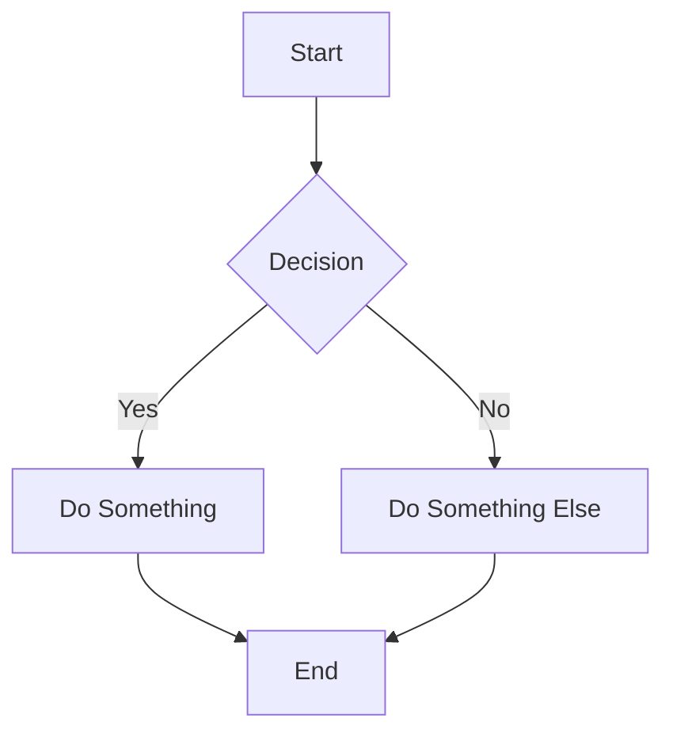
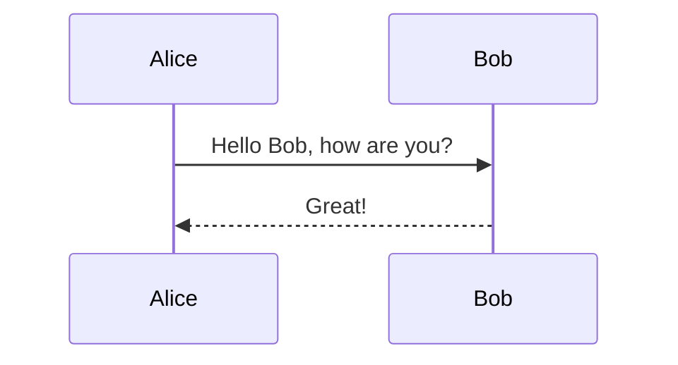

# Test Mermaid Diagram

This is a test README with a Mermaid diagram.

## Simple Flowchart



## Sequence Diagram



## Code Block (Not Mermaid)

```javascript
function hello() {
    console.log("Hello, World!");
}
```

This should work fine.